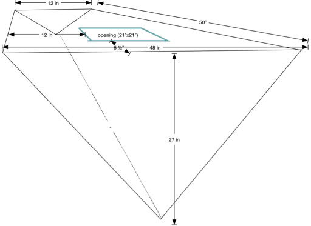

# Introduction

The objective is to compute the volume of a water tank under the V-berth on a boat.

The problem we have is that it's really difficult to get accurate measurements.
We needs a spreadsheet-like capability to

-  Define a computation. In this case, a rather complex one.

-  Provide inputs.

-  See results. We want immediate gratification here. A "compute all cells" kind of thing
   that will rework the math with our new measurements.

Additionally, we want to be able to diagnose errors in the computation, which
means a bunch of cells with hidden formulae aren't optimal. We want to see the
details, including some demonstration that they work. You know, test cases.

For the non-nautical, the V-berth is the v-shaped bedroom built into the bow of
the boat. This is a complex shape, flat on the top, but V-shaped on the bottom.
It sweeps up at the forward end, almost coming to a point.

This isn't easy to visualize. The following sketch views the tank from the aft end
looking forward, toward the pointy end of the boat.
It shows how there's a triangular face aft, and a much smaller triangular face forward.
The top tapers from the aft end, and is a kind of truncated triangle.
The sides slope down along the inside of the boat's hull.

This diagram is facing forward, showing the large triangle at the aft end of the tank.
The sizes were preliminary measurements, later refined as the top was cut away to gain 
access to the interior. 

We can describe the space in a number of ways, leading us to three models for the volume:

-   **Regular Triangular Prism**. While the space tapers from the large aft end to almost a point at the forward end, 
    we can use the midpoints along this axis to define
    a triangular prism that should be equivalent to the irregular shape.

-   **Regular Tetrahedron**. While the tank isn't really regular, we can take the mean lengths of the six edges, 
    and use this to describe a regular tetrahedron that should have a similar volume.

-   **Irregular Triangular Prism**. The tank is a prism that tapers from aft to forward. We can describe this taper
    as a function of the distance along the fore-and-aft axis of the tank.

The differences, it turns out, are relatively minor. The simpler math of a triangular prism
is accurate enough for our purposes. The other two models serve as confirmation of the volume.

While a single estimate of the volume is necessary, it's not sufficient. 
As the top of the structure was removed, it became easier to get more accurate measuremewnts.
What would help is a closed form function that transforms a given collection measurements
into a volume estimate.

It helps to have the computation in the form of a Jupyter Notebook.
We can change the measurements and see resulting change in the volume.
This lets us answer a number of design tradeoff questions regarding ways
to assemble new water tanks or flexible bladders to fill the leaky old aluminum tank that's in there.

We'll start with the Triangular Prism, because it involves the least math.
